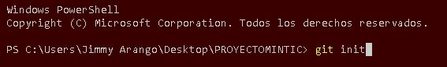
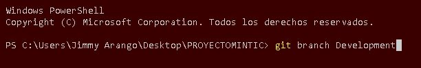
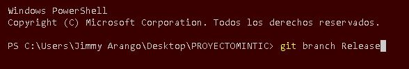
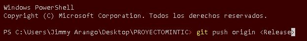

# Comienzo 🚀 

## Creación repositorio

### Creación ramas

## Integrantes

|            correo              |   nombre   |       rol       |
|--------------------------------|------------|-----------------|
|    jimmy.arango.ossa@gmail.com |       Jimmy|    Desarrollador|
|    Camilo.orozcohdz@gmail.com  |      Camilo| Administrador BD|
|    bdbastidas88@gmail.com      |       David|    Product Owner|
|     mmilenaog@hotmail.com      |      Milena|         Analista|
| jcatalinabenavides@hotmail.com |    Catalina|     Scrum Master|

## Link repositorio

[repositorio](https://github.com/jimalaros/PROYECTOMINTIC)

## Link trello

[trello](https://trello.com/b/7LCMouja/proyecto-software)
